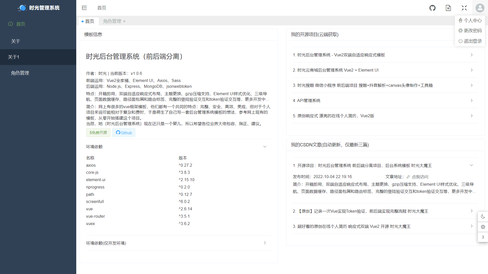

# 时光Vue2后台管理系统 vue2-element-sgadmin

## 注意：仓库里只有前端文件，后端文件暂不开放！

作者：时光 | 当前版本：v1.0.16

前端运用：Vue2全家桶、Element UI、Axios、Sass

后端运用：Node.js、Express、MongoDB、jsonwebtoken

特点：开箱即用，双端自适应响应式布局、主题更换、gzip压缩支持、Element UI样式优化、三级导航、页面数据缓存、路径面包屑和路由标签、完整的登陆验证交互和token验证交互、角色权限管理(菜单权限)等，更多开发中...

简介：网上有很多的vue框架模板，他们都有一个共同的特点：完整、安全、高效、美观，但对于个人项目来说可能相对于复杂和费时，于是萌生了自己写一套后台管理系统模板的想法，参考网上现有的模板，从零开始搭建这个项目。
当然，她（时光后台管理系统）现在还只是一个婴儿，所以希望各位业界大佬包容、指正、建议。



## Project setup
```
npm install
```

### Compiles and hot-reloads for development
```
npm run serve
```

### Compiles and minifies for production
```
npm run build
```

### Customize configuration
See [Configuration Reference](https://cli.vuejs.org/config/).
